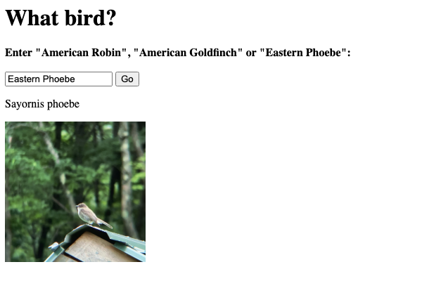

# What Bird
This simple web application accepts a common bird name and return the latin name and image.
[View Live Project](https://heidifryzell.com/what-bird/)

## How It's Made:
This is web application that accesses an Express API. The frontend uses fetch to retrieve the data from the API.

This is part of the self-paced software engineering I am completing: [#100devs](https://100devs.org/about).

### Tech Used:
- Javascript

## Optimizations
It would be a great improvement to have more birds available in the API. Now there are only three.

I would add CSS to style the application.

## Lessons Learned
I learned about the difference between client-side and server-side javascript. This code can be run locally and still access the remote API hosted on render.com.

## Related Projects
Here is where the Bird API data is hosted:
https://bird-api-hdc8.onrender.com/api/birds

NOTE: The *What Bird* web application is hosted on free web hosting and may take up to a minute to spin up when you fill the form and make a request.

